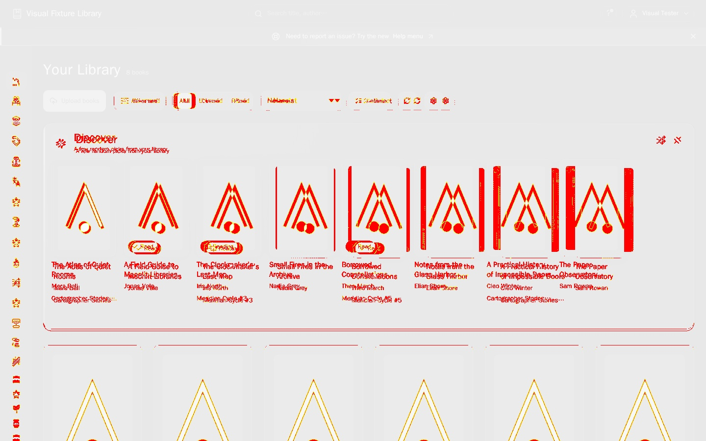

# Visual regression red proof — 2026-08-31

Status: **OBSERVED, CSS perturbation reverted**

The committed catalog baseline was generated by the private Linux rig. To prove
the lane detects a real rendering change, `frontend/src/styles/tokens.css` was
temporarily changed from `--sp-4: 1rem` to `--sp-4: 1.25rem`, and the worktree
was rebuilt into the rig app image.

```bash
E2E_VISUAL_REGRESSION=1 \
  ./local-dev/private-e2e-rig.sh test <worktree> \
  --project=visual-regression-chromium --grep='desktop catalog'
```

- Result: exit 1; `toHaveScreenshot('catalog-desktop.png')` reported **67,775
  different pixels (6% of the 1440×900 frame)**.
- Altered app identity: image
  `sha256:e536522d8fb3c0c1f2a486e549c9dcde9e7ca0a1b17774c41b4918bf11baf718`;
  served bundle `index-G7lmQEnK.js`, bundle SHA-256
  `70cd33dadb209dd79ed689c2daaf311feb03a67ffae52f982cdf4b0d05116fac`.
- The rig repeated that identity after the failed run; neither image nor bundle
  moved while the comparison was running.
- Playwright diff SHA-256:
  `17a7019cdd7178564818bb19c28e6e3f8eff2d9cbd96062ca5dd3cd7614cb975`.
  The adjacent JPEG is the same generated diff converted for review; its
  SHA-256 is
  `0363b3348186a8dfecb341fe0152df07b77b556e11462c26f2f9786962fa375b`.



After this capture the token was restored to `1rem`. The clean-image green run
is recorded in `state/MISSION.md`; no production CSS change remains in the
branch diff.
